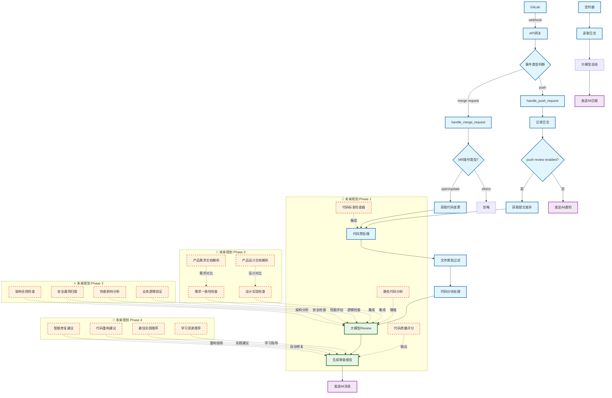
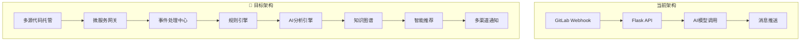
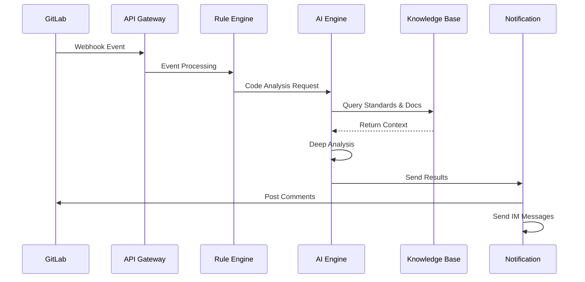

# AI代码审查增强流程图

## 当前流程概述

基于现有的AI代码审查系统，当前流程包括GitLab webhook触发、事件类型判断、代码审查和消息推送等核心功能。

## 优化后的完整流程图



## 详细流程说明

### 🔄 当前核心流程

#### 1. 事件接收与分发
- **GitLab Webhook**: 接收push和merge request事件
- **API网关**: 统一处理和验证webhook请求
- **事件路由**: 根据事件类型分发到不同处理器

#### 2. 代码审查流程
- **代码获取**: 通过GitLab API获取变更内容
- **预处理**: 文件过滤、代码分块、格式化
- **AI审查**: 调用大模型进行代码分析
- **报告生成**: 格式化审查结果并推送

#### 3. 通知与日志
- **即时通知**: 钉钉、企业微信、飞书消息推送
- **日志记录**: 审查历史和统计信息
- **定时报告**: 每日工作总结

### 🚀 未来规划详解

#### Phase 1: 代码质量增强 (3-6个月)
```
🎯 目标: 提升代码审查的准确性和全面性

📋 功能规划:
├── 代码标准检查器
│   ├── 编码规范验证 (PEP8, ESLint等)
│   ├── 命名规范检查
│   └── 代码风格统一性
├── 静态代码分析集成
│   ├── SonarQube集成
│   ├── CodeClimate集成
│   └── 自定义规则引擎
└── 代码质量评分系统
    ├── 复杂度评估
    ├── 可维护性指数
    └── 技术债务评估
```

#### Phase 2: 需求与设计对齐 (6-9个月)
```
🎯 目标: 确保代码实现与产品需求、设计文档一致

📋 功能规划:
├── 产品需求文档解析
│   ├── 需求文档自动解析
│   ├── 功能点提取
│   └── 需求变更追踪
├── 产品设计文档解析
│   ├── UI/UX设计规范检查
│   ├── API设计一致性验证
│   └── 数据模型对比
└── 一致性检查引擎
    ├── 需求实现完整性
    ├── 设计实现准确性
    └── 变更影响分析
```

#### Phase 3: 深度技术分析 (9-12个月)
```
🎯 目标: 实现全方位的技术质量保障

📋 功能规划:
├── 架构合规检查
│   ├── 分层架构验证
│   ├── 设计模式识别
│   └── 依赖关系分析
├── 安全漏洞扫描
│   ├── OWASP Top 10检查
│   ├── 敏感信息泄露检测
│   └── 权限控制验证
├── 性能影响分析
│   ├── 算法复杂度分析
│   ├── 数据库查询优化
│   └── 内存使用评估
└── 业务逻辑验证
    ├── 业务规则一致性
    ├── 数据流完整性
    └── 异常处理完备性
```

#### Phase 4: 智能化辅助 (12-18个月)
```
🎯 目标: 提供智能化的代码改进建议和学习指导

📋 功能规划:
├── 智能修复建议
│   ├── 自动代码修复
│   ├── 重构方案生成
│   └── 优化建议推荐
├── 学习与成长
│   ├── 个性化学习路径
│   ├── 最佳实践库
│   └── 技能提升建议
└── 团队协作增强
    ├── 代码审查协作
    ├── 知识共享平台
    └── 团队技能地图
```

## 技术架构规划

### 🏗️ 系统架构演进



### 📊 数据流设计



## 实施路线图

### 🗓️ 时间规划

| 阶段 | 时间周期 | 主要目标 | 关键里程碑 |
|------|----------|----------|------------|
| **Phase 1** | 3-6个月 | 代码质量增强 | 静态分析集成、质量评分 |
| **Phase 2** | 6-9个月 | 需求设计对齐 | 文档解析、一致性检查 |
| **Phase 3** | 9-12个月 | 深度技术分析 | 架构检查、安全扫描 |
| **Phase 4** | 12-18个月 | 智能化辅助 | 自动修复、学习推荐 |

### 🎯 成功指标

#### 量化指标
- **代码质量提升**: 缺陷率降低50%
- **审查效率**: 审查时间缩短30%
- **开发效率**: 代码返工率降低40%
- **团队满意度**: 开发者满意度>85%

#### 质量指标
- **审查准确性**: 误报率<5%
- **覆盖完整性**: 规则覆盖率>90%
- **响应及时性**: 审查响应时间<2分钟
- **学习效果**: 团队技能提升可量化

## 技术选型建议

### 🔧 核心技术栈

```yaml
代码分析:
  - 静态分析: SonarQube, ESLint, Pylint
  - 安全扫描: Bandit, Safety, Snyk
  - 架构分析: Dependency-cruiser, Madge

文档处理:
  - 文档解析: Pandoc, Apache Tika
  - 自然语言处理: spaCy, NLTK
  - 知识图谱: Neo4j, Apache Jena

AI/ML:
  - 大模型: GPT-4, Claude, DeepSeek
  - 向量数据库: Pinecone, Weaviate
  - 机器学习: scikit-learn, TensorFlow

基础设施:
  - 消息队列: Redis, RabbitMQ
  - 数据库: PostgreSQL, MongoDB
  - 缓存: Redis, Memcached
  - 监控: Prometheus, Grafana
```

## 总结

这个增强版的AI代码审查流程图展现了从当前基础功能到未来智能化深度审查的完整演进路径。通过分阶段实施，我们将构建一个集成代码标准、产品需求、设计文档的全方位代码质量保障系统，最终实现真正的深度代码评审能力。

### 🌟 核心价值
1. **质量保障**: 多维度代码质量检查
2. **效率提升**: 自动化审查和智能建议
3. **知识传承**: 团队最佳实践积累
4. **持续改进**: 基于数据的流程优化

这个规划将使AI代码审查系统从简单的语法检查工具演进为智能化的代码质量管家和团队成长助手。 