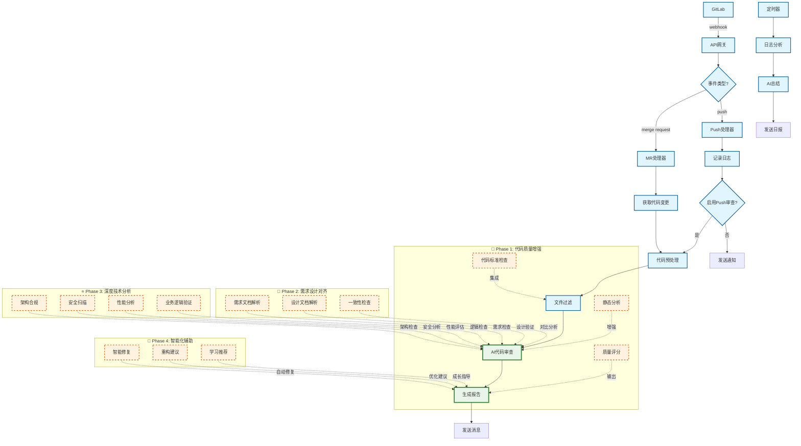
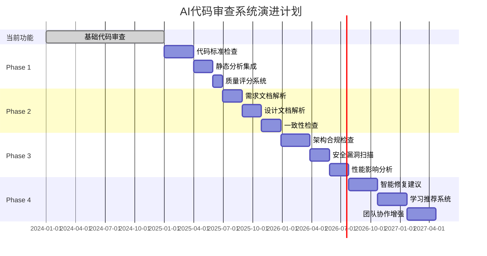

# AI代码审查增强流程图 - 简化版

## 当前功能 + 未来规划流程图



## 功能演进路线图

### 📅 实施时间线



## 核心价值主张

### 🎯 当前价值
- ✅ **自动化审查**: 减少人工审查工作量
- ✅ **即时反馈**: 快速发现代码问题
- ✅ **团队协作**: 统一的审查标准
- ✅ **历史追踪**: 完整的审查记录

### 🚀 未来价值
- 🔮 **智能质量**: 全方位代码质量保障
- 🔮 **需求对齐**: 确保实现符合产品需求
- 🔮 **架构守护**: 维护系统架构一致性
- 🔮 **成长助手**: 个性化技能提升指导

## 技术实现要点

### Phase 1: 代码质量增强
```python
# 示例：集成静态分析
class CodeQualityAnalyzer:
    def __init__(self):
        self.sonar_client = SonarQubeClient()
        self.eslint_runner = ESLintRunner()
        
    def analyze(self, code_changes):
        # 静态分析
        static_issues = self.sonar_client.analyze(code_changes)
        # 代码风格检查
        style_issues = self.eslint_runner.check(code_changes)
        # 质量评分
        quality_score = self.calculate_quality_score(static_issues, style_issues)
        
        return {
            'static_issues': static_issues,
            'style_issues': style_issues,
            'quality_score': quality_score
        }
```

### Phase 2: 需求设计对齐
```python
# 示例：需求一致性检查
class RequirementAlignmentChecker:
    def __init__(self):
        self.doc_parser = DocumentParser()
        self.nlp_processor = NLPProcessor()
        
    def check_alignment(self, code_changes, requirement_docs):
        # 解析需求文档
        requirements = self.doc_parser.extract_requirements(requirement_docs)
        # 分析代码实现
        implementations = self.analyze_implementations(code_changes)
        # 对比检查
        alignment_result = self.compare_req_impl(requirements, implementations)
        
        return alignment_result
```

### Phase 3: 深度技术分析
```python
# 示例：架构合规检查
class ArchitectureComplianceChecker:
    def __init__(self):
        self.dependency_analyzer = DependencyAnalyzer()
        self.pattern_detector = DesignPatternDetector()
        
    def check_compliance(self, code_changes):
        # 依赖关系分析
        dependencies = self.dependency_analyzer.analyze(code_changes)
        # 设计模式检测
        patterns = self.pattern_detector.detect(code_changes)
        # 架构层次验证
        layer_compliance = self.check_layer_compliance(dependencies)
        
        return {
            'dependencies': dependencies,
            'patterns': patterns,
            'layer_compliance': layer_compliance
        }
```

### Phase 4: 智能化辅助
```python
# 示例：智能修复建议
class IntelligentFixSuggester:
    def __init__(self):
        self.ai_model = CodeFixAIModel()
        self.knowledge_base = BestPracticesKB()
        
    def suggest_fixes(self, issues, code_context):
        # AI生成修复建议
        ai_suggestions = self.ai_model.generate_fixes(issues, code_context)
        # 最佳实践推荐
        best_practices = self.knowledge_base.get_recommendations(issues)
        # 学习资源推荐
        learning_resources = self.recommend_learning_resources(issues)
        
        return {
            'ai_suggestions': ai_suggestions,
            'best_practices': best_practices,
            'learning_resources': learning_resources
        }
```

这个增强版流程图展现了AI代码审查系统的完整演进蓝图，从当前的基础功能逐步发展为智能化的代码质量管家和团队成长助手。 